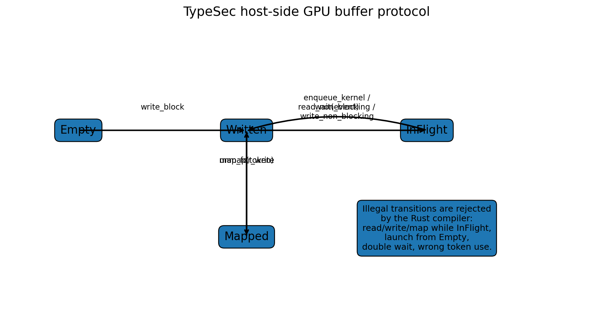
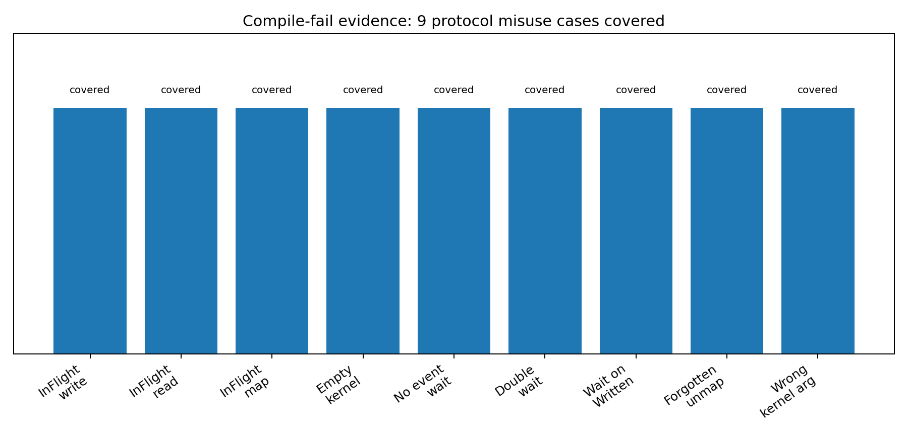
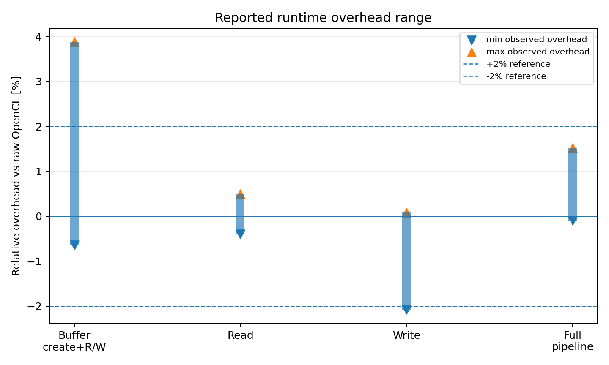

# TypeSec

> Compile-time resource safety for GPU APIs: a zero-cost Rust typestate framework for safe host–device interaction with OpenCL.

[](LICENCE)


---

## Table of contents

- [Overview](#overview)
- [Research idea](#research-idea)
- [Why this repository matters](#why-this-repository-matters)
- [Core contribution](#core-contribution)
- [What the type system prevents](#what-the-type-system-prevents)
- [Protocol state machine](#protocol-state-machine)
- [Repository structure](#repository-structure)
- [Crate structure](#crate-structure)
- [API concept](#api-concept)
- [Quick start](#quick-start)
- [Running the example](#running-the-example)
- [Compile-fail evidence](#compile-fail-evidence)
- [SPEC ↔ test mapping](#spec--test-mapping)
- [Benchmarks](#benchmarks)
- [Zero-cost evaluation](#zero-cost-evaluation)
- [Reproducibility](#reproducibility)
- [Hardware / software environment](#hardware--software-environment)
- [Benchmark stabilization scripts](#benchmark-stabilization-scripts)
- [Documentation map](#documentation-map)
- [Result archive](#result-archive)
- [How to interpret the project](#how-to-interpret-the-project)
- [Known limitations](#known-limitations)
- [Recommended cleanup / next steps](#recommended-cleanup--next-steps)
- [Citation](#citation)
- [License](#license)

---

## Overview

`TypeSec` is a Rust research artifact for making host-side GPU programming safer without adding runtime checks.

The repository contains the `hpc-core` crate, a high-level type-state API over OpenCL. The API encodes GPU buffer states and host–device protocol transitions in Rust types. Illegal host actions become compile-time errors.

The project focuses on a common class of GPU-host mistakes:

- reading a buffer while an asynchronous operation is still in flight,
- writing to a buffer that is currently used by a queued operation,
- launching a kernel with an uninitialized buffer,
- ignoring an event token,
- waiting twice on the same event,
- mixing resources from incompatible queue/context lineages,
- passing invalid or ABI-incompatible kernel arguments.

The core claim is:

> Many host-side GPU API protocol errors can be prevented at compile time using Rust typestates, linear tokens, branding lifetimes, and zero-cost abstractions.

The repository includes:

- Rust source code for the `hpc-core` API,
- a simple OpenCL vector-add example,
- `trybuild` compile-fail tests,
- Criterion benchmarks against raw OpenCL,
- reproduction instructions,
- paper evaluation notes,
- zero-cost assembly/code-size evidence,
- a citation file,
- SPEC-to-test mapping.

---

## Research idea

Low-level GPU APIs such as OpenCL and CUDA expose powerful primitives, but they also expose protocol obligations to the host program.

A typical host-side interaction looks like this:

```text
create context
create queue
allocate buffer
copy host data to device
set kernel arguments
launch kernel
wait for completion
read result back
```

The problem is that many API protocols are implicit. A raw host API may allow code that compiles but is logically wrong:

```text
read before kernel finished
write while operation is in flight
launch kernel with uninitialized buffer
forget to wait for event
reuse an event token twice
mix queue/context resources accidentally
```

`TypeSec` turns those implicit runtime protocols into explicit compile-time states.

Instead of tracking only:

```rust
Buffer<T>
```

the API tracks:

```rust
DeviceBuffer<'brand, T, Written>
DeviceBuffer<'brand, T, InFlight>
DeviceBuffer<'brand, T, Empty>
DeviceBuffer<'brand, T, Mapped>
```

The state parameter controls which methods are available. A buffer in `InFlight` simply does not expose host-side read/write methods.

---

## Why this repository matters

GPU programming bugs often arise at the boundary between a safe host language and an unsafe device/runtime API.

This project demonstrates a practical Rust strategy:

| Problem | TypeSec mechanism |
|---|---|
| Misordered host/device actions | Type-state transitions |
| Ignored synchronization events | Linear `EventToken` and `#[must_use]` |
| Double wait / token reuse | Consuming token API |
| Cross-context or cross-queue mixing | Branding lifetime `'brand` |
| Invalid host access during async operation | State-gated method availability |
| ABI-sensitive kernel arguments | Typed kernel argument guards |
| Runtime overhead concerns | Zero-cost wrapper evaluation |

The interesting part is not that Rust can wrap OpenCL. The interesting part is that Rust can make invalid host-side GPU protocols unrepresentable while compiling away the safety markers.

---

## Core contribution

The repository contributes a small, concrete artifact around three ideas.

### 1. Typestate protocol encoding

GPU buffers carry a state marker:

```rust
DeviceBuffer<'brand, T, S>
```

where `S` is one of:

```rust
Empty
Written
Mapped
InFlight
```

Only certain state transitions are allowed.

### 2. Linear synchronization tokens

Asynchronous operations return a buffer in `InFlight` plus an `EventToken`.

```rust
let (buf_f, event) = buf_w.enqueue_kernel(&queue, &kernel, global)?;
let buf_w = event.wait(buf_f);
```

The token is consumed by `wait`. This prevents accidental double-wait or wait-on-wrong-state patterns.

### 3. Zero-cost safety

State markers and branding lifetimes exist only at compile time. They use Rust’s type system and `PhantomData`-style markers rather than runtime checks.

The evaluation reports:

- no additional hot-path branches or loops in assembly spot checks,
- wrapper functions inlined into raw OpenCL calls,
- runtime overhead close to zero across buffer, read, write, and full-pipeline benchmarks.

---

## What the type system prevents

The repository documents nine core prevented misuse classes.

| Rule | Prevented misuse | Mechanism |
|---|---|---|
| F1 | Write on buffer in `InFlight` | State-gated methods |
| F2 | Read on buffer in `InFlight` | State-gated methods |
| F3 | Mapping from `InFlight` | State-gated methods |
| F4 | Kernel launch from `Empty` | State-gated kernel API |
| F5 | `EventToken` used without `wait()` | `#[must_use]` token |
| F6 | Double `wait()` on same token | Linear consumed token |
| F7 | `wait()` on wrong state such as `Written` | Typed wait signature |
| F8 | Forgotten unmap / `MapToken` unused | `#[must_use]` guard/token |
| F9 | Kernel argument ABI mismatch | Typed argument guard |

These cases are mapped to compile-fail tests in `SPEC-tests-map.md`.

---

## Protocol state machine

<p align="center">
  
</p>

The host-side protocol is:

```text
Empty
  └── write_block / map_for_write_block
        ↓
Written
  ├── enqueue_kernel / read_non_blocking / write_non_blocking
  │     ↓
  │   InFlight
  │     └── wait(event)
  │           ↓
  │        Written
  └── map_for_write
        ↓
      Mapped
        └── unmap(token)
              ↓
           Written
```

The key guarantee is that there is no public method path such as:

```text
InFlight → read_blocking
InFlight → write_blocking
InFlight → map
Empty → enqueue_kernel
```

Those operations fail at compile time.

---

## Repository structure

```text
.
├── .github/
├── crates/
│   └── hpc-core/
│       ├── benches/
│       │   └── memcpy_api_criterion.rs
│       ├── examples/
│       │   ├── bloat_target.rs
│       │   ├── bloat_target_opencl.rs
│       │   ├── simple_vector_add.rs
│       │   └── vec_add.cl
│       ├── src/
│       │   ├── api/
│       │   ├── buffer/
│       │   ├── error/
│       │   └── lib.rs
│       ├── tests/
│       │   ├── compile_fail/
│       │   └── compile_fail.rs
│       └── Cargo.toml
├── docs/
│   ├── cross_mapping.md
│   ├── reproduce.md
│   ├── session_types.md
│   └── zero_cost.md
├── paper/
│   └── evaluation.md
├── results/
│   ├── 2025-08-21/
│   ├── 2025-08-25/
│   └── 2025-08-26/
├── scripts/
│   ├── benchmark_cleanup.sh
│   ├── benchmark_setup.sh
│   ├── cuda_benchmark.cu
│   └── opencl_benchmark.c
├── CITATION.cff
├── Cargo.toml
├── Cargo.lock
├── LICENCE
└── SPEC-tests-map.md
```

---

## Crate structure

The workspace currently contains one crate:

```text
crates/hpc-core
```

`hpc-core` is described as a high-performance type-safe Rust API for OpenCL. It depends on:

- `opencl3` for OpenCL bindings,
- `thiserror` for error handling,
- `once_cell`,
- `bytemuck` for safe byte casts / layout-oriented operations,
- `serde` and `serde_json` for optional logging / memtracing,
- `trybuild` for compile-fail tests,
- `criterion` for benchmarks.

The crate re-exports the high-level API types:

```rust
Context
Queue
Kernel
DeviceBuffer
EventToken
ReadGuard
Result
Error
```

and the state markers:

```rust
Empty
Written
Mapped
InFlight
```

---

## API concept

A minimal happy-path workflow looks like this:

```rust
use hpc_core::*;

fn main() -> Result<()> {
    let ctx = Context::create_context()?;
    let queue = ctx.create_queue()?;

    let size = 1024;
    let a: Vec<u32> = vec![1; size];
    let b: Vec<u32> = vec![1; size];
    let mut result: Vec<u32> = vec![0; size];

    let kernel_source = r#"
        __kernel void vector_add(
            __global const uint* a,
            __global const uint* b,
            __global uint* result,
            const unsigned int size
        ) {
            int gid = get_global_id(0);
            if (gid < size) {
                result[gid] = a[gid] + b[gid];
            }
        }
    "#;

    let buffer_a = ctx.create_empty_buffer::<u32>(size)?
        .write_block(&queue, &a)?;        // Empty -> Written

    let buffer_b = ctx.create_empty_buffer::<u32>(size)?
        .write_block(&queue, &b)?;        // Empty -> Written

    let buffer_result = ctx.create_empty_buffer::<u32>(size)?
        .write_block(&queue, &result)?;   // Empty -> Written

    let kernel = Kernel::from_source(&ctx, kernel_source, "vector_add")?;

    kernel.set_arg_buffer(0, &buffer_a)?;
    kernel.set_arg_buffer(1, &buffer_b)?;
    kernel.set_arg_buffer(2, &buffer_result)?;
    kernel.set_arg_scalar(3, &(size as u32))?;

    let (inflight_buffer, event) =
        buffer_result.enqueue_kernel(&queue, &kernel, size)?; // Written -> InFlight

    let result_buffer = event.wait(inflight_buffer);           // InFlight -> Written

    result_buffer.read_blocking(&queue, &mut result)?;         // stays Written

    Ok(())
}
```

The important part is not the vector addition itself. The important part is that the type of `buffer_result` changes across the protocol:

```text
Empty → Written → InFlight → Written
```

---

## Quick start

### Requirements

A typical setup needs:

```text
Linux x86_64
Rust toolchain
OpenCL runtime
NVIDIA GPU + driver, or another compatible OpenCL GPU runtime
```

Install Rust:

```bash
curl https://sh.rustup.rs -sSf | sh
rustup default stable
```

Clone the repository:

```bash
git clone https://github.com/TheBuccaneer/type_sec.git
cd type_sec
```

Build the workspace:

```bash
cargo build
```

Run regular tests:

```bash
cargo test
```

---

## Running the example

Run the vector-add example:

```bash
cargo run -p hpc-core --example simple_vector_add
```

Expected behavior:

```text
Preparing: 1024 elements
Buffers created and initialized
Kernel compiled
Kernel arguments set
Kernel started
Kernel completed
Results read back
Vector addition successful! All 1024 results correct.
```

The exact printed output may differ, but the example should compile, launch an OpenCL vector-add kernel, wait for completion, read the result, and verify that all outputs are correct.

---

## Compile-fail evidence

The project uses `trybuild` tests to show that invalid host-side GPU protocols fail to compile.

Run:

```bash
cargo test -p hpc-core --tests
```

When updating expected compiler diagnostics:

```bash
TRYBUILD=overwrite cargo test -p hpc-core --tests
```

The compile-fail harness runs all Rust files under:

```text
crates/hpc-core/tests/compile_fail/*.rs
```

The directory includes both the invalid Rust examples and their expected `.stderr` snapshots.

<p align="center">
  
</p>

Example invalid cases:

```text
api_inflight_write.rs
api_inflight_read.rs
api_inflight_map.rs
api_empty_kernel.rs
api_no_event_use.rs
api_wouble_wait.rs
api_wait_on_written.rs
api_forget_unmap.rs
api_wrong_arg.rs
```

The compile-fail tests are important because they are executable evidence. They do not merely claim that the type system prevents misuse; they assert that representative invalid programs do not type-check.

---

## SPEC ↔ test mapping

The repository includes a specification-to-test mapping in:

```text
SPEC-tests-map.md
```

This document links each executable protocol specification rule to its corresponding compile-fail test.

| Rule-ID | Description | Test file |
|---|---|---|
| F1 | Write on buffer in `InFlight` | `api_inflight_write.rs` |
| F2 | Read on buffer in `InFlight` | `api_inflight_read.rs` |
| F3 | Mapping from `InFlight` | `api_inflight_map.rs` |
| F4 | Kernel launch from `Empty` | `api_empty_kernel.rs` |
| F5 | `EventToken` used without `wait()` | `api_no_event_use.rs` |
| F6 | Double `wait()` on `EventToken` | `api_wouble_wait.rs` |
| F7 | `wait()` on wrong state | `api_wait_on_written.rs` |
| F8 | Forgotten unmap / `MapToken` unused | `api_forget_unmap.rs` |
| F9 | Kernel argument ABI mismatch | `api_wrong_arg.rs` |

---

## Benchmarks

Criterion benchmarks compare the type-state API against a raw OpenCL baseline.

Run:

```bash
cargo bench -p hpc-core --benches
```

The benchmark file is:

```text
crates/hpc-core/benches/memcpy_api_criterion.rs
```

It includes comparisons for:

| Benchmark group | Meaning |
|---|---|
| `api_buffer_bench` vs `raw_buffer_bench` | Buffer create + write + read pipeline |
| `api_read_bench` vs `raw_read_bench` | Device-to-host read performance |
| `api_write_bench` vs `raw_write_bench` | Host-to-device write performance |
| `api_full_bench` vs `raw_full_bench` | Full vector-add pipeline: write → kernel → read |

The benchmark sizes include:

```text
1 KB
64 KB
1 MB
16 MB
100 MB
```

and for the full pipeline:

```text
1 KB
4 KB
16 KB
64 KB
256 KB
1 MB
```

---

## Zero-cost evaluation

The repository reports three kinds of zero-cost evidence.

### 1. Runtime Criterion benchmarks

Reported runtime overhead stays close to zero.

<p align="center">
  
</p>

The largest positive reported overhead in the documented tables is `+3.88%` for the 16 MB buffer create/read/write path. Most other values are close to zero, and several are negative due to measurement noise.

### 2. Code-size analysis with `cargo-bloat`

The evaluation notes report that more than 97% of binary text size comes from the standard library in the probe binaries, while `hpc-core` contributes less than 1%.

The reported diff between the raw OpenCL baseline and the type-state API treatment is approximately `0–2%` in the top-20 functions.

Example commands:

```bash
cargo bloat -p hpc-core --release --example bloat_target -n 20 \
  > results/YYYY-MM-DD/bloat/top20_api.txt

cargo bloat -p hpc-core --release --example bloat_target_opencl -n 20 \
  > results/YYYY-MM-DD/bloat/top20_base.txt

diff -u results/YYYY-MM-DD/bloat/top20_base.txt \
       results/YYYY-MM-DD/bloat/top20_api.txt \
  > results/YYYY-MM-DD/bloat/diff_top20.txt
```

### 3. Assembly spot checks

The evaluation inspects hot-path functions such as `write_block` and `enqueue_kernel` with `cargo-asm`.

Example:

```bash
cargo asm -p hpc-core --release --lib --rust hpc_core::api::write_block
cargo asm -p hpc-core --release --lib --rust hpc_core::api::enqueue_kernel
```

The reported observation is that wrappers are inlined and no additional branches or loops remain beyond calls to the underlying OpenCL operations.

---

## Reproducibility

The repository includes a reproduction guide:

```text
docs/reproduce.md
```

A typical full reproduction path is:

```bash
# 1. Stabilize benchmark environment
./scripts/benchmark_setup.sh

# 2. Run example
cargo run -p hpc-core --example simple_vector_add

# 3. Run compile-fail tests
cargo test -p hpc-core --tests

# 4. Run Criterion benchmarks
cargo bench -p hpc-core --benches

# 5. Run bloat checks
cargo bloat -p hpc-core --release --example bloat_target -n 20
cargo bloat -p hpc-core --release --example bloat_target_opencl -n 20

# 6. Restore system defaults
./scripts/benchmark_cleanup.sh
```

The benchmark setup and cleanup scripts should be inspected before use because they adjust system-level settings such as CPU governor, GPU clocks, persistence mode, NUMA behavior, C-states, and I/O scheduler.

---

## Hardware / software environment

The reproduction document reports the following measurement environment:

| Component | Reported configuration |
|---|---|
| OS | Linux x86_64, tested on Ubuntu 22.04 |
| Rust | 1.89.0 |
| GPU | NVIDIA GeForce RTX 3090 |
| Driver | NVIDIA 570.169 |
| CUDA | 12.8 |
| OpenCL runtime | OpenCL 3.0 CUDA 12.8.97 |
| CPU | AMD Ryzen Threadripper 3970X 32-Core Processor |

The reproduction notes also mention that the GPU link was pinned to PCIe Gen3 in the measurements because higher link speeds caused bandwidth-stability issues on the platform.

---

## Benchmark stabilization scripts

The scripts directory contains:

```text
scripts/benchmark_setup.sh
scripts/benchmark_cleanup.sh
scripts/cuda_benchmark.cu
scripts/opencl_benchmark.c
```

The setup script is intended to stabilize the environment before benchmarking.

Reported setup actions include:

- setting CPU governor to performance,
- disabling turbo/boost,
- fixing NVIDIA GPU clocks,
- enabling persistence mode,
- pinning NUMA behavior,
- disabling NUMA auto-balancing,
- disabling C-states,
- flushing caches,
- setting I/O scheduler.

The cleanup script restores the system defaults after measurement.

Because these scripts can change host settings, read them before running them on a shared machine.

---

## Documentation map

| Document | Purpose |
|---|---|
| `docs/session_types.md` | Main conceptual explanation of states, transitions, lifetimes, branding, and safety guarantees. |
| `docs/reproduce.md` | Commands and environment details for benchmarks, trybuild evidence, bloat checks, and assembly checks. |
| `docs/zero_cost.md` | Short zero-cost summary and assembly excerpt. |
| `docs/cross_mapping.md` | Mapping between `hpc-core`, OpenCL, CUDA/SYCL concepts. |
| `paper/evaluation.md` | Paper-style evaluation snippet with code-size, assembly, runtime benchmark, and compile-fail evidence. |
| `SPEC-tests-map.md` | Mapping from protocol rules to compile-fail tests. |
| `CITATION.cff` | Citation metadata for the software and preferred paper citation. |

---

## Result archive

The repository includes result folders:

```text
results/2025-08-21/
results/2025-08-25/
results/2025-08-26/
```

The reproduction guide notes that raw Criterion outputs of five benchmark runs are stored under:

```text
results/2025-08-25/criterion/run1
results/2025-08-25/criterion/run2
results/2025-08-25/criterion/run3
results/2025-08-25/criterion/run4
results/2025-08-25/criterion/run5
```

Additional archived result types include:

```text
trybuild_errors
bloat
asm
```

depending on the run date.

---

## How to interpret the project

### This is not “just a wrapper”

The main value is not that Rust can call OpenCL. The value is that the wrapper enforces a protocol that the raw API normally leaves to the programmer.

### Compile-fail tests are central evidence

The project should be evaluated by looking at the invalid programs under `tests/compile_fail/`. Those tests demonstrate which misuse classes are rejected by the compiler.

### Zero-cost means “markers compile away”

The state markers and branding lifetimes are compile-time constructs. The evaluation argues that they do not produce measurable runtime checks or hot-path branching.

### This is a research artifact

The current crate is best understood as a proof-of-concept and evaluation artifact for host-side GPU protocol safety. It is not yet a polished crates.io library or full GPU programming framework.

---

## Known limitations

- The API targets OpenCL rather than all GPU runtimes.
- The public API focuses on a selected host-side protocol subset.
- Multi-queue and multi-device hazards are explicitly out of scope in the session-type notes.
- Zero-copy, pinning, and advanced mapping strategies are out of scope.
- The benchmarks are tied to a specific hardware/software environment.
- The result archive is useful, but the repository would benefit from more generated summary tables at the root level.
- The workspace root `Cargo.toml` appears compact/minified and should be reformatted for readability.
- The package metadata in `crates/hpc-core/Cargo.toml` references `MIT OR Apache-2.0`, while the repository-level visible license is Apache-2.0; this should be made consistent.
- The repository currently has no short GitHub description or topics, so the project is less discoverable than it should be.

---

## Recommended cleanup / next steps

### 1. Add this file as root `README.md`

The current repository has strong documentation fragments, but the root GitHub page needs a clear artifact overview.

### 2. Add GitHub repository metadata

Suggested description:

```text
Compile-time resource safety for GPU APIs: a zero-cost Rust typestate framework for OpenCL host protocols.
```

Suggested topics:

```text
rust
opencl
gpu
typestate
session-types
compile-time-safety
hpc
trybuild
criterion
zero-cost-abstractions
```

### 3. Reformat root `Cargo.toml`

The root `Cargo.toml` should be expanded into normal TOML formatting for readability.

### 4. Add a short `docs/API_OVERVIEW.md`

This should show only the happy path and two invalid examples.

### 5. Add a one-command artifact check

Example:

```bash
bash scripts/reproduce_minimal.sh
```

Expected content:

```bash
cargo test -p hpc-core --tests
cargo run -p hpc-core --example simple_vector_add
```

### 6. Add CI

A GitHub Actions workflow could run:

```bash
cargo fmt --check
cargo clippy --workspace --all-targets -- -D warnings
cargo test -p hpc-core --tests
```

The OpenCL example and GPU benchmarks probably need to remain optional because GitHub-hosted runners generally do not provide the target GPU/OpenCL setup.

### 7. Add summary CSVs for benchmark tables

The paper evaluation currently contains the main numbers. A CSV under `results/summary/` would make the benchmark claims easier to audit.

### 8. Add final DOI once available

`CITATION.cff` already contains conference-paper metadata and a placeholder comment for a future DOI. Once the DOI exists, add it there and badge it in this README.

---

## Citation

The repository includes `CITATION.cff` metadata.

Suggested BibTeX-style citation:

```bibtex
@inproceedings{bicanic_typesec_2025,
  author    = {Bicanic, Tihomir Thomas},
  title     = {Compile-Time Resource Safety for GPU APIs: A Low-Overhead Typestate Framework},
  booktitle = {Herbsttreffen der GI-Fachgruppe Betriebssysteme},
  year      = {2025},
  location  = {Aachen, Germany},
  note      = {Software artifact: TypeSec}
}
```

For the software artifact itself:

```bibtex
@software{typesec_2025,
  author  = {Bicanic, Tihomir Thomas},
  title   = {TypeSec: Compile-Time Resource Safety for GPU APIs},
  version = {v0.3.1},
  date    = {2025-08-29},
  url     = {https://github.com/TheBuccaneer/type_sec},
  license = {Apache-2.0}
}
```

When reporting reproduced results, include:

- repository commit hash,
- Rust version,
- OpenCL runtime,
- GPU model,
- driver version,
- benchmark date,
- whether system stabilization scripts were used,
- Criterion output directory,
- compile-fail snapshot directory,
- bloat/assembly output directory.

---

## License

This repository is released under the Apache License 2.0. See [LICENCE](LICENCE).

The `hpc-core` crate metadata currently states `MIT OR Apache-2.0`; make sure the repository-level and crate-level licensing story is consistent before publication or crates.io release.
